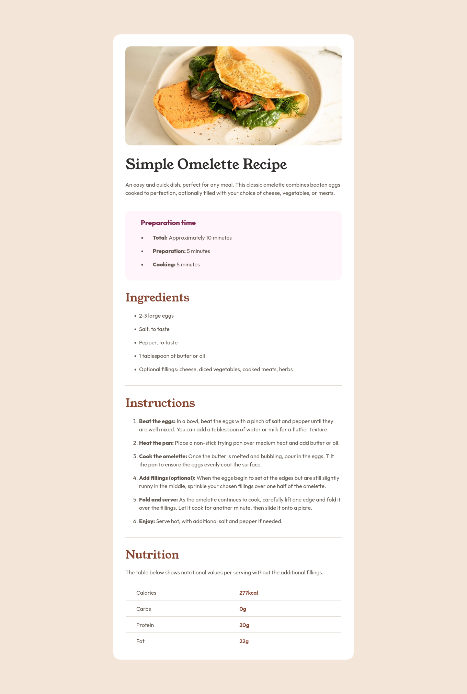
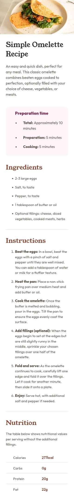

# Frontend Mentor - Solución de la página de recetas

Esta es una solución al [desafío de la página de recetas en Frontend Mentor](https://www.frontendmentor.io/challenges/recipe-page-KiTsR8QQKm). Los desafíos de Frontend Mentor te ayudan a mejorar tus habilidades de codificación mediante la creación de proyectos realistas.

## Índice

- [Frontend Mentor - Solución de la página de recetas](#frontend-mentor---solución-de-la-página-de-recetas)
  - [Índice](#índice)
  - [Descripción general](#descripción-general)
    - [Captura de pantalla](#captura-de-pantalla)
      - [Desktop Desing](#desktop-desing)
      - [Mobile Desing](#mobile-desing)
    - [Enlaces](#enlaces)
  - [Mi proceso](#mi-proceso)
    - [Creado con](#creado-con)
    - [Lo que aprendí](#lo-que-aprendí)
  - [Autor](#autor)

## Descripción general

### Captura de pantalla

#### Desktop Desing



#### Mobile Desing



### Enlaces

- URL de la solución: [GitHub](https://github.com/jean266/Pagina_recetas)
- URL del sitio en vivo: [Vervel]()

## Mi proceso

### Creado con

- Marcado HTML5 semántico
- Propiedades personalizadas de CSS
- Flujo de trabajo para dispositivos móviles 
- Gulp
- SASS

### Lo que aprendí

```css

```

## Autor

- Mentor de frontend: [@jean266](https://www.frontendmentor.io/profile/jean266)